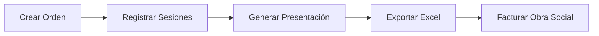

# 🏥 Gestor de Órdenes - Sistema de Gestión para Profesionales de la Salud


## 📋 Tabla de Contenidos

- [Descripción del Proyecto](#descripción-del-proyecto)
- [Problema que Resuelve](#problema-que-resuelve)
- [Características Principales](#características-principales)
- [Stack Tecnológico](#stack-tecnológico)
- [Instalación y Uso](#instalación-y-uso)
- [Guía de Usuario](#guía-de-usuario)
- [Arquitectura Técnica](#arquitectura-técnica)
- [Algoritmo de Facturación](#algoritmo-de-facturación)
- [Testing y Debugging](#testing-y-debugging)
- [Roadmap](#roadmap)
- [Contribuciones](#contribuciones)
- [Documentación Técnica](#documentación-técnica)
- [Licencia](#licencia)

## 📖 Descripción del Proyecto

**Gestor de Órdenes** es un **Proof of Concept (POC)** de un sistema SaaS multi-tenant diseñado específicamente para **profesionales de la salud en Argentina**. El sistema optimiza la gestión administrativa de órdenes de consulta post-autorizadas, permitiendo el seguimiento completo desde la recepción de la orden hasta la generación de reportes de facturación.

### 🎯 Objetivo Principal

Centralizar y organizar todas las órdenes médicas para, al final de cada período, consolidar la información y generar los reportes de presentación requeridos por cada **Obra Social** para la gestión del cobro.

## 🚨 Problema que Resuelve

Los profesionales de la salud en Argentina enfrentan una **significativa carga administrativa** al manejar:

- ✅ Órdenes de múltiples obras sociales con diferentes formatos
- ✅ Seguimiento manual de sesiones realizadas vs. autorizadas
- ✅ Cálculo complejo de aranceles con fechas de vigencia
- ✅ Aplicación de límites mensuales por paciente/obra social
- ✅ Generación de reportes mensuales para facturación
- ✅ Consolidación de datos para múltiples obras sociales

## 🚀 Características Principales

### ✨ Funcionalidades Implementadas

| Módulo | Descripción | Estado |
|--------|-------------|--------|
| **🏠 Dashboard** | Vista general con estadísticas y check-in rápido | ✅ Completo |
| **📋 Gestión de Órdenes** | Crear, listar, filtrar y gestionar órdenes | ✅ Completo |
| **✅ Check-in Diario** | Registro rápido de sesiones por DNI | ✅ Completo |
| **💰 Presentaciones** | Generación automática de reportes de facturación | ✅ Completo |
| **📊 Exportación Excel** | Export real con librerías JavaScript | ✅ Completo |

### 🎮 Flujo de Trabajo Validado



1. **Carga de Órdenes**: Crear pacientes y órdenes con validaciones
2. **Registro de Sesiones**: Check-in diario por DNI con un click
3. **Generación de Presentaciones**: Algoritmo complejo con límites y aranceles
4. **Exportación**: Excel real para envío a obras sociales

## 🛠️ Stack Tecnológico

### Frontend
- **HTML5** - Estructura semántica
- **JavaScript Vanilla** - Lógica de negocio sin frameworks
- **Bootstrap 5** - UI framework responsive
- **Bootstrap Icons** - Iconografía consistente

### Persistencia
- **LocalStorage** - Almacenamiento local para el POC
- **JSON** - Formato de datos estructurado

### Librerías
- **SheetJS (xlsx.js)** - Exportación real a Excel
- **No dependencias de Node.js** - 100% frontend

### Arquitectura
- **Patrón de módulos** - Namespace organizado
- **Separación de responsabilidades** - Storage, Data, Utils, App, UI
- **Event-driven** - Manejo de eventos centralizado

## 🚀 Instalación y Uso

### Requisitos Mínimos
- Navegador moderno (Chrome, Firefox, Safari, Edge)
- No requiere servidor web (funciona con `file://`)

### 📦 Instalación

```bash
# Clonar el repositorio
git clone https://github.com/tu-usuario/gestor-ordenes.git
cd gestor-ordenes

# No requiere instalación adicional - es 100% frontend
```

### ▶️ Ejecución

#### Opción 1: Doble click
```bash
# Simplemente abrir index.html en el navegador
open index.html  # macOS
start index.html # Windows
xdg-open index.html # Linux
```

#### Opción 2: Servidor local (recomendado)
```bash
# Python 3
python -m http.server 8000

# Python 2
python -m SimpleHTTPServer 8000

# Node.js (si tienes npx)
npx serve .

# Luego abrir: http://localhost:8000
```

### 🧪 Datos de Prueba

El sistema viene **precargado** con datos de prueba:

| Tipo | Cantidad | Ejemplos |
|------|----------|----------|
| **Pacientes** | 5 | María José Rodríguez (DNI: 12345678) |
| **Obras Sociales** | 4 | Swiss Medical, Galeno, Medife, Sancor |
| **Prácticas** | 5 | Kinesiología, Osteopatía, Rehabilitación |
| **Órdenes** | 3 | 2 abiertas, 1 cerrada con sesiones completas |

#### 🔍 DNIs para Testing
- `12345678` - María José Rodríguez (Swiss Medical) - 3 sesiones realizadas
- `23456789` - Carlos Alberto Fernández (Galeno) - 2 sesiones realizadas  
- `34567890` - Ana Sofía Martínez (Medife) - 10 sesiones completas

## 📱 Guía de Usuario

### 🏠 Dashboard Principal (`index.html`)

El punto de entrada del sistema con:

- **📊 Estadísticas en tiempo real**: Órdenes activas, sesiones realizadas/pendientes
- **🔍 Check-in rápido**: Búsqueda por DNI para registro inmediato
- **📋 Órdenes recientes**: Vista de las últimas órdenes creadas
- **⚡ Acciones rápidas**: Enlaces directos a crear orden o presentación

**Ejemplo de uso**:
1. Ingresar DNI `12345678` en el campo de búsqueda
2. Hacer click en "Buscar"
3. Seleccionar "Registrar Sesión de Hoy" en la orden deseada

### 📋 Gestión de Órdenes (`pages/ordenes.html`)

Centro de control para el manejo completo de órdenes:

#### Crear Nueva Orden
1. Click en "Nueva Orden"
2. Seleccionar paciente existente o crear uno nuevo
3. Elegir obra social, médico derivante y práctica
4. Definir fecha de emisión y cantidad de sesiones
5. El sistema **automáticamente** genera todas las sesiones pendientes

#### Filtros Avanzados
- **Estado**: Abierta, Cerrada Normal, Cerrada Manual
- **Paciente**: Búsqueda por nombre
- **Obra Social / Práctica**: Filtros por categoría
- **Rango de fechas**: Período específico

#### Acciones Disponibles
- **👁️ Ver detalle**: Modal completo con información de sesiones
- **❌ Cerrar orden**: Marcar manualmente como completada

### ✅ Check-in Diario (`pages/checkin.html`)

Interfaz optimizada para el flujo diario más común:

#### Flujo de Check-in
1. **Búsqueda por DNI**: Input grande y accesible
2. **Mostrar órdenes activas**: Lista filtrada del paciente
3. **Un click para registrar**: "Registrar Sesión de Hoy"
4. **Confirmación visual**: Modal con detalles de la sesión

#### Funcionalidades Extra
- **Marcar ausente**: Registro de inasistencias
- **Historial del día**: Todas las sesiones registradas hoy
- **Manejo de errores**: Paciente no encontrado, sin órdenes activas

### 💰 Presentaciones (`pages/presentaciones.html`)

Módulo más complejo del sistema para facturación:

#### Generar Presentación
1. **Seleccionar período**: Mes y año deseado
2. **Vista previa**: Ver qué se incluirá sin guardar
3. **Generar definitiva**: Crear registro y marcar sesiones como presentadas
4. **Exportar Excel**: Descarga automática del archivo

#### Algoritmo Inteligente
- **Recolección automática**: Sesiones realizadas en el período
- **Aplicación de límites**: Respeta límites mensuales por obra social
- **Cálculo de aranceles**: Usa tarifas vigentes en fecha de prestación
- **Agrupación por OS**: Reportes organizados por obra social

## 🏗️ Arquitectura Técnica

### 📁 Estructura de Archivos

```
MedApp/
├── index.html              # 🏠 Dashboard principal
├── pages/
│   ├── ordenes.html       # 📋 Gestión de órdenes  
│   ├── checkin.html       # ✅ Check-in diario
│   └── presentaciones.html # 💰 Generación de reportes
├── js/
│   ├── app.js             # 🧠 Lógica principal y UI
│   ├── storage.js         # 💾 LocalStorage management
│   ├── data.js            # 📊 Datos de prueba y ejemplos
│   └── utils.js           # 🔧 Utilidades y helpers
├── css/
│   └── style.css          # 🎨 Estilos personalizados
├── test.html              # 🧪 Página de testing y debugging
├── README_POC.md          # 📖 Documentación técnica detallada
└── README.md              # 📋 Este archivo
```

### 🧩 Patrón de Módulos

```javascript
// Namespace organizado
const GestorOrdenes = {
    storage: { /* Operaciones LocalStorage */ },
    data: { /* Datos de prueba e inicialización */ },
    utils: { /* Funciones auxiliares */ },
    app: { /* Lógica de negocio */ },
    ui: { /* Manipulación del DOM */ },
    debug: { /* Herramientas de debugging */ }
};
```

### 💾 Schema de LocalStorage

| Clave | Descripción | Ejemplo |
|-------|-------------|---------|
| `gestorOrdenes_ordenes` | Array de órdenes del profesional | `[{id: 1, paciente_id: 1, ...}]` |
| `gestorOrdenes_sesiones` | Array de todas las sesiones | `[{id: 1, orden_id: 1, estado: 'Realizada'}]` |
| `gestorOrdenes_pacientes` | Catálogo compartido de pacientes | `[{id: 1, nombreCompleto: 'Juan Pérez'}]` |
| `gestorOrdenes_obras_sociales` | Catálogo de obras sociales | `[{id: 1, nombre: 'Swiss Medical'}]` |
| `gestorOrdenes_initialized` | Flag de inicialización | `'true'` |

## ⚙️ Algoritmo de Facturación

El **núcleo más complejo** del sistema que implementa las reglas de negocio específicas:

### 🔄 Flujo de 5 Pasos

#### 1️⃣ **Recolección de Sesiones Candidatas**
```javascript
// Criterios de inclusión:
- pertenecen al profesional_id actual
- estado !== 'Presentada' 
- obra social con incluir_en_presentacion = true
- ALGUNA de estas condiciones:
  * estado = 'Realizada' Y fechaPrestacion en período
  * orden 'Cerrada Manual' Y fechaCierre en período  
  * estado = 'Realizada' Y fechaPrestacion anterior (diferidas)
```

#### 2️⃣ **Aplicación de Límites Mensuales**
```javascript
// Por cada grupo (obra_social + paciente):
if (limite_sesiones_mensual_paciente > 0) {
    // Ordenar por fechaPrestacion (más antigua primero)
    // Tomar solo las primeras N sesiones
    sesiones = sesiones.slice(0, limite);
}
```

#### 3️⃣ **Cálculo de Importes**
```javascript
// Para cada sesión:
const arancel = buscarArancelVigente(
    practica_id, 
    obraSocial_id, 
    fechaPrestacion
);
// Usa la tarifa más reciente pero anterior a la fecha de prestación
```

#### 4️⃣ **Consolidación por Obra Social**
- Agrupación automática por OS
- Subtotales por grupo
- Total general
- Formato de reporte estructurado

#### 5️⃣ **Persistencia y Actualización**
- Crear registro en tabla `Presentaciones`
- Marcar sesiones como `'Presentada'`
- Generar logs de auditoría

### 📊 Reglas de Negocio Implementadas

| Regla | Descripción | Implementación |
|-------|-------------|----------------|
| **Límites mensuales** | Max sesiones por paciente/OS | Slice de array ordenado |
| **Aranceles históricos** | Precio vigente en fecha prestación | Lookup con filtro de fecha |
| **Sesiones diferidas** | Incluir pendientes de meses anteriores | Filtro de fecha flexible |
| **Estados exclusivos** | Una sesión no puede presentarse 2 veces | Estado 'Presentada' |

## 🧪 Testing y Debugging

### 🔬 Página de Testing (`test.html`)

Herramienta completa para validación:

```javascript
// Funciones disponibles:
- runAllTests()           // Suite completa de pruebas
- testSearch()           // Buscar paciente específico
- testCreateOrder()      // Crear orden de prueba  
- testRegisterSession()  // Registrar sesión
- testGenerateBilling()  // Generar presentación
- forceUpdateData()      // Fix cache de LocalStorage
```

### 🔧 Herramientas de Consola

```javascript
// Debugging desde DevTools:
GestorOrdenes.debug.checkOrder3()      // Diagnosticar orden específica
GestorOrdenes.debug.forceUpdateData()  // Actualizar datos forzosamente
GestorOrdenes.data.reset()             // Reset completo
```

### 🐛 Solución de Problemas Comunes

#### ❌ "Los datos no se actualizan"
```javascript
// Problema: Cache de LocalStorage
// Solución:
GestorOrdenes.debug.forceUpdateData();
// O refrescar navegador con Ctrl+F5
```

#### ❌ "No aparecen las sesiones de Ana Sofía"
```javascript
// El sistema auto-detecta y corrige en data.js:init()
// Si persiste, ejecutar manualmente:
GestorOrdenes.data.forceUpdate();
```

#### ❌ "Error en generación de presentación"
```javascript
// Verificar que hay sesiones realizadas:
const sesiones = GestorOrdenes.storage.sesiones.getRealizadas();
console.log('Sesiones realizadas:', sesiones.length);
```

## 🚀 Roadmap

### 📋 Próximos Pasos para MVP

#### **Fase 1: Backend Integration**
- [ ] API REST con Node.js/Express o Python/Django  
- [ ] Base de datos PostgreSQL/MySQL
- [ ] Autenticación JWT real
- [ ] Multi-tenancy con aislamiento por profesional

#### **Fase 2: Seguridad y Escalabilidad**
- [ ] Encriptación de datos sensibles
- [ ] Auditoría completa de acciones
- [ ] Rate limiting y protección CSRF
- [ ] Backup automático de datos

#### **Fase 3: Funcionalidades Avanzadas**
- [ ] OCR para digitización automática de órdenes
- [ ] QR codes para check-in de pacientes
- [ ] Reportes avanzados y analytics
- [ ] Integración con APIs de obras sociales
- [ ] App móvil React Native

#### **Fase 4: Integraciones**
- [ ] Facturación electrónica AFIP
- [ ] Sincronización con sistemas de gestión hospitalaria
- [ ] API pública para desarrolladores
- [ ] Webhooks para notificaciones

### 🎯 Funcionalidades v2.0

| Funcionalidad | Descripción | Prioridad |
|---------------|-------------|-----------|
| **📱 App Móvil** | React Native para check-in móvil | 🔥 Alta |
| **🤖 OCR Órdenes** | Digitalización automática | 🔥 Alta |
| **📊 Analytics** | Dashboard con métricas avanzadas | 🟡 Media |
| **🔗 Integraciones** | APIs de obras sociales | 🟡 Media |
| **💬 Notificaciones** | WhatsApp/SMS automático | 🔵 Baja |

## 🤝 Contribuciones

### 📋 Cómo Contribuir

1. **Fork** del repositorio
2. **Clone** tu fork localmente
3. Crear **branch** para tu feature: `git checkout -b feature/nueva-funcionalidad`
4. **Commit** con mensajes descriptivos: `git commit -m "Add: nueva funcionalidad X"`
5. **Push** a tu branch: `git push origin feature/nueva-funcionalidad`
6. Crear **Pull Request** con descripción detallada

### ✅ Guidelines de Desarrollo

- **Código limpio**: Seguir patrones existentes
- **Comentarios**: Documentar lógica compleja
- **Testing**: Probar en múltiples navegadores
- **Responsive**: Verificar en móvil y desktop
- **Performance**: Optimizar para LocalStorage grande

### 🏷️ Estructura de Commits

```
tipo: descripción breve

Descripción más detallada si es necesario

- Cambio específico 1
- Cambio específico 2

Resolves #123
```

**Tipos de commits**:
- `feat`: Nueva funcionalidad
- `fix`: Corrección de bug  
- `docs`: Documentación
- `style`: Formato de código
- `refactor`: Reestructuración
- `test`: Pruebas
- `chore`: Tareas de mantenimiento

## 📚 Documentación Técnica

### Documentos Adicionales

- **[📖 POC Detallado](docs/POC.md)** - Documentación técnica completa del POC
- **[⚙️ Configuración Claude](/.claude/Claude.md)** - Guía para Claude Code IDE  
- **[🧪 Testing](test.html)** - Página interactiva de pruebas

### Arquitectura de Carpetas

```
📁 docs/           # Documentación adicional
📁 .claude/        # Configuración Claude Code
├── examples/      # Ejemplos de UI/UX
└── Claude.md      # Guía técnica
```

## 📄 Licencia

Este proyecto está licenciado bajo la **MIT License** - ver el archivo [LICENSE](LICENSE) para detalles.

### 🙏 Reconocimientos

- **Bootstrap** - Framework UI
- **Bootstrap Icons** - Iconografía
- **SheetJS** - Exportación Excel
- **GitHub** - Hosting del repositorio
- **Anthropic Claude** - Asistencia en desarrollo

---

## 📞 Soporte y Contacto

- **🐛 Issues**: [GitHub Issues](https://github.com/tu-usuario/gestor-ordenes/issues)
- **💬 Discusiones**: [GitHub Discussions](https://github.com/tu-usuario/gestor-ordenes/discussions)
- **📧 Email**: tu-email@dominio.com

---

<div align="center">

**⭐ Si este proyecto te resulta útil, no olvides darle una estrella ⭐**

*Desarrollado con ❤️ para optimizar la gestión administrativa de profesionales de la salud*

</div>